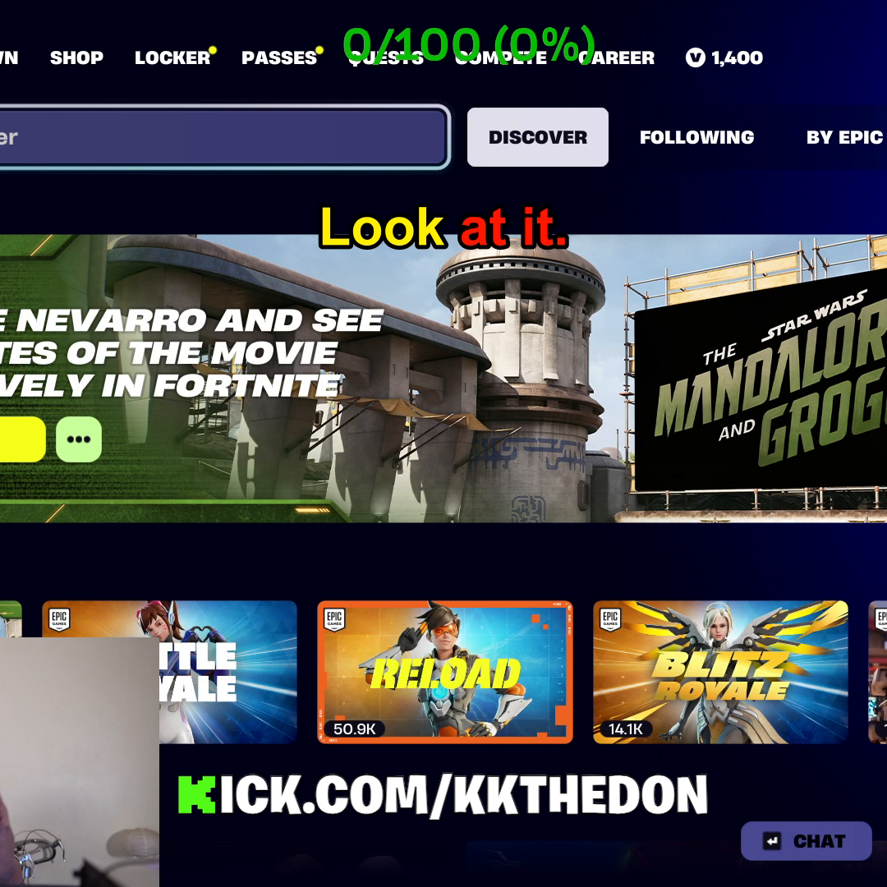
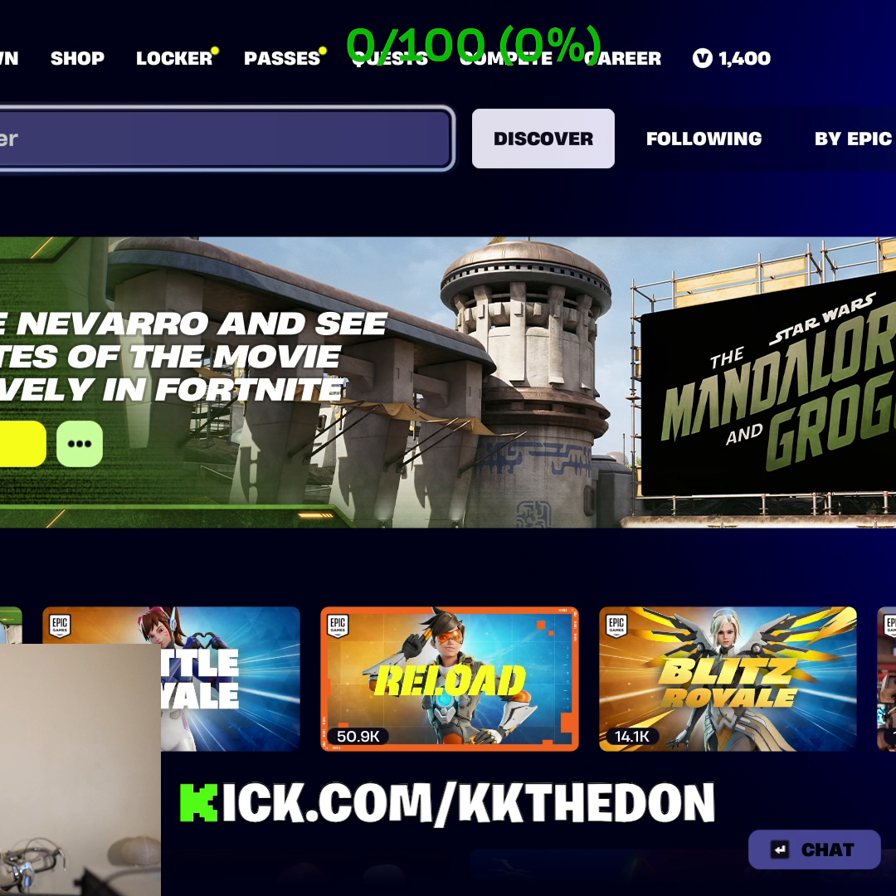
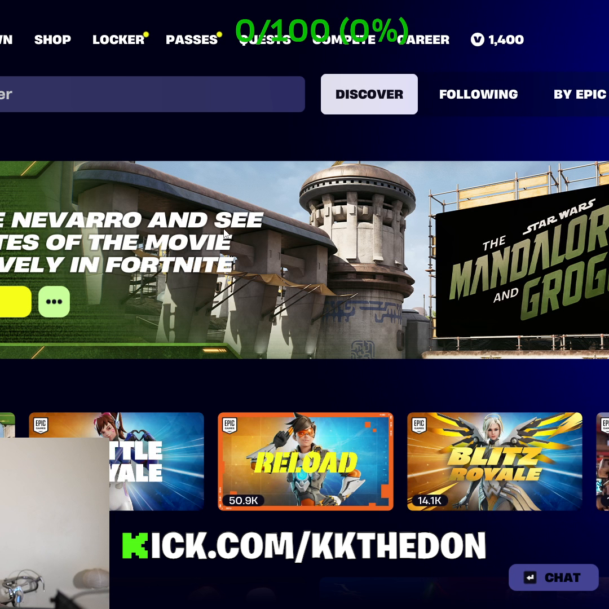
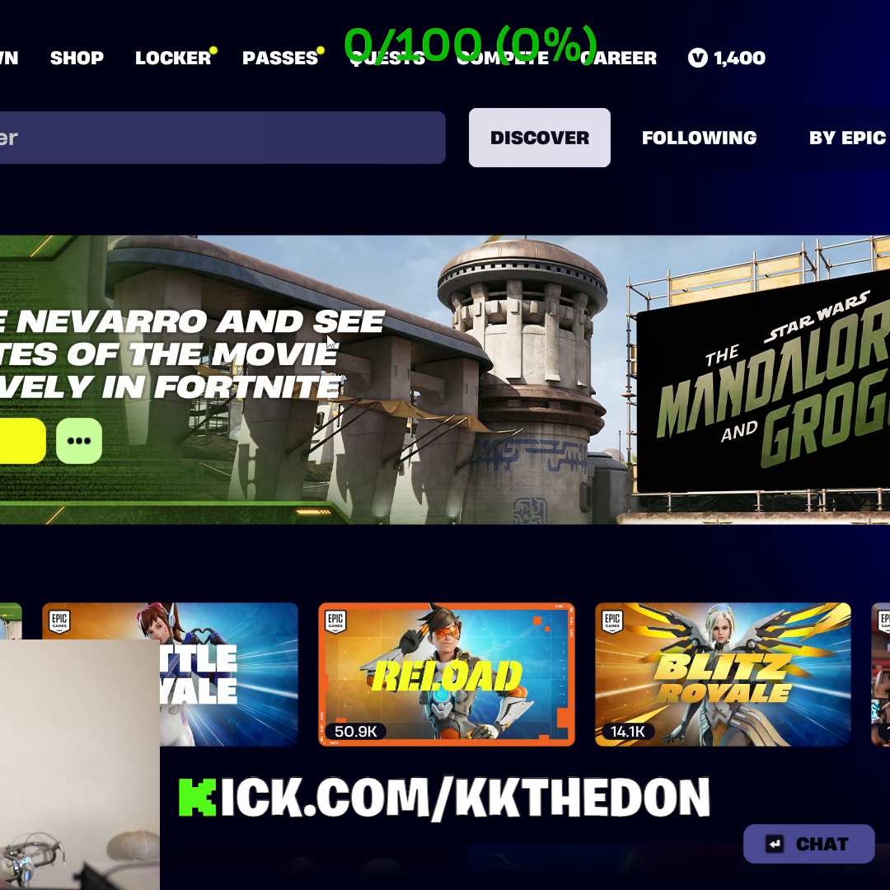
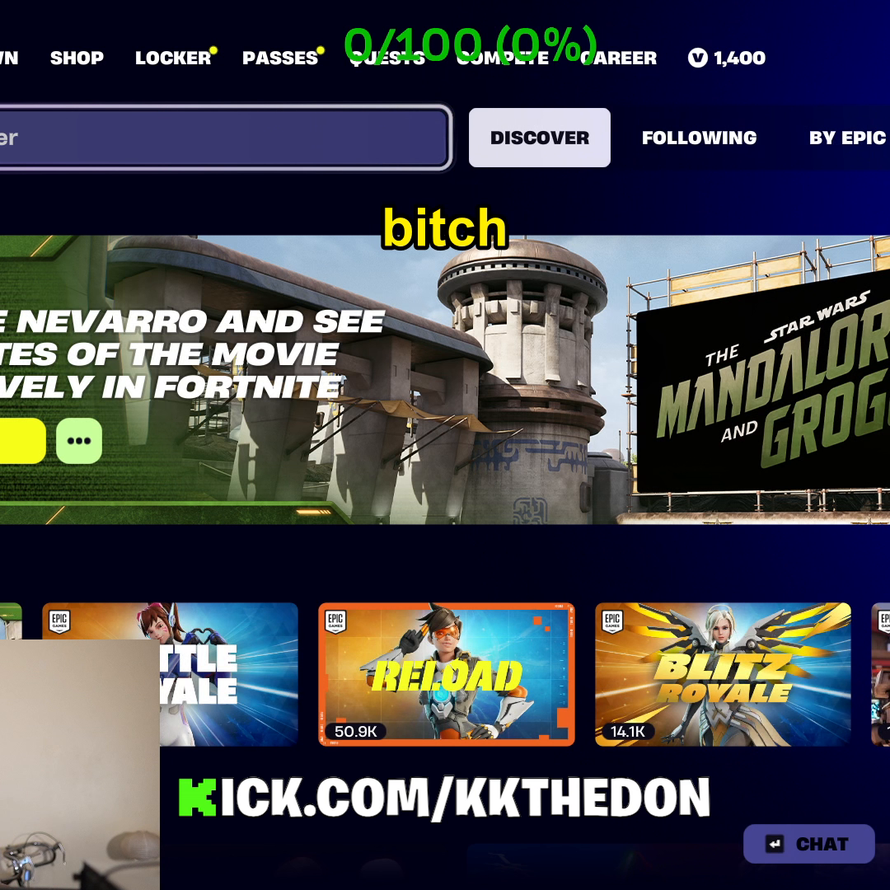
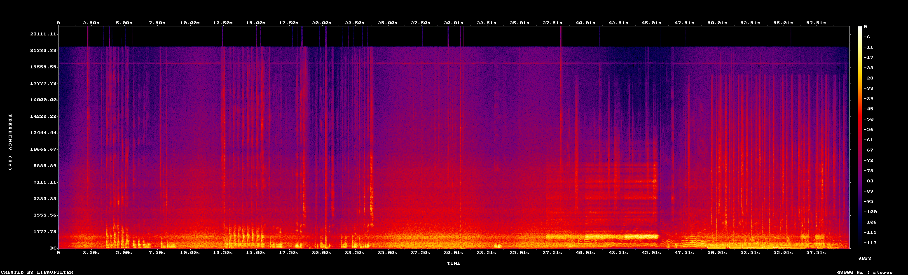

# Quality report — 2026-05-20 01-25-08_clip_0_60__square.mp4

- **Path:** `C:\Users\donald\Documents\ContentCreation\renders\square\2026-05-20 01-25-08_clip_0_60__square.mp4`
- **Duration:** 60.00 s
- **File size:** 25.21 MB
- **Overall bitrate:** 3525 kbps

## Video

- **Codec:** h264 (Main)
- **Resolution:** 1080x1080
- **Frame rate:** 60/1
- **Pixel format:** yuv420p
- **Color primaries:** bt709
- **Color transfer:** bt709
- **Color space:** bt709
- **Color range:** tv
- **Bit rate:** 3260380 bps

## Audio

- **Codec:** aac
- **Sample rate:** 48000 Hz
- **Channels:** 2 (stereo)
- **Bit rate:** 251533 bps

## Loudness (ebur128)

- **Integrated:** -14.1 LUFS  (target: -14 for TikTok/IG)
- **Loudness range:** 8.4 LU  (target: ~7 LU for short-form)
- **True peak:** -0.1 dBTP  (must be < -1.0 dBTP to survive platform re-encode)

## Inspection artifacts

- 
- 
- 
- 
-   (dialogue-active frame — captions visible)
- 

## Captions (.ass sidecar)

- **Canvas:** PlayResX=1080, PlayResY=1080
- **Font:** Marker Felt 72pt, bold=1, alignment=8, MarginV=240
- **Colors (mint preset expected):** primary=&H000000FF, secondary=&H000000FF, outline=&H00000000, back=&H00000000
  - Reference: TEXT=`&H000000FF` (red), HIGHLIGHT=`&H0000FFFF` (yellow)
- **Border / outline:** style=1, outline=5px
- **Dialogue events:** 24
- **Latin-script check:** PASS (every dialogue line is Latin script)

### Caption geometry

- **Inferred layout:** square  (canvas 1080x1080)
- **Line height:** 100.8 px = 9.33% of canvas  (< 8% required)
- **Caption baseline (MarginV):** 240 px from top
- **Caption bottom edge (estimated):** y = 340.8 px
- **Top safe area:** y < 90 px (platform UI zone)
- **Face-top heuristic:** y = 216.0 px  (captions must finish above this)
- **Horizontal margins:** L=0, R=0  (must be equal for top-center alignment)

**Professional-quality checks:**
- FAIL `size_ok`
- PASS `centering_ok`
- PASS `above_safe_top`
- FAIL `face_clear (heuristic)`
- PASS `alignment_top_center`

**Overall verdict: FAIL**

**Why it failed:**
- FontSize 72.0pt produces a line ~101px tall (9.3% of canvas) — exceeds the 8% max. Captions will dominate the frame ('letters take up whole clip').
- Caption bottom edge at y=341px crosses the heuristic face-top line at y=216px (20% down the square canvas). Captions will overlap the speaker's face. (If the streamer's webcam is in a non-typical position, this heuristic can false-positive — add face detection to disambiguate.)

### Sample dialogue (first 8 lines)

- `3.18s` -> `3.88s`: Don't don't like
- `3.88s` -> `4.12s`: Don't don't like
- `4.12s` -> `4.40s`: Don't don't like
- `4.40s` -> `4.66s`: like like
- `4.66s` -> `4.96s`: like like
- `5.92s` -> `6.44s`: Look at it.
- `6.44s` -> `6.96s`: Look at it.
- `6.96s` -> `7.04s`: Look at it.
