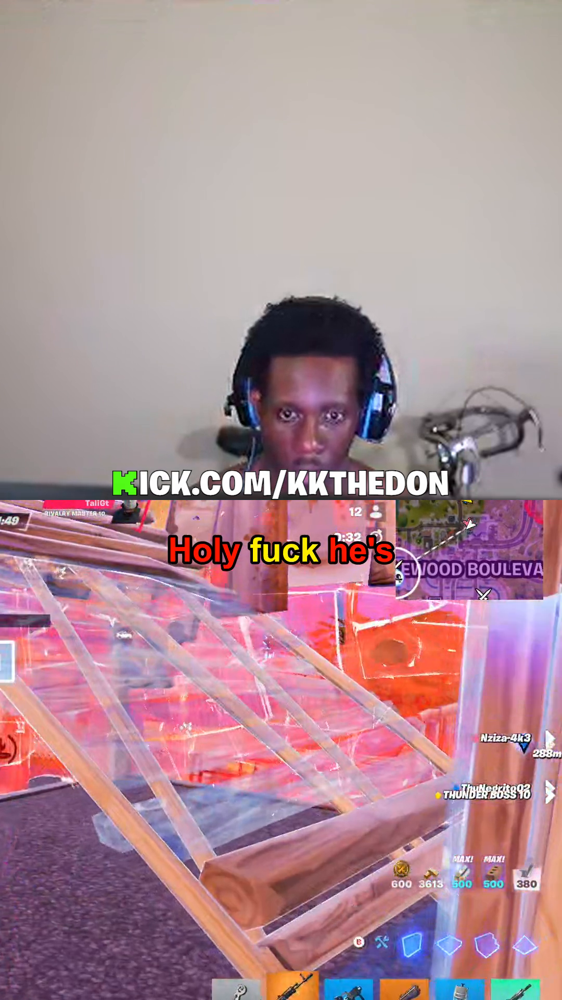
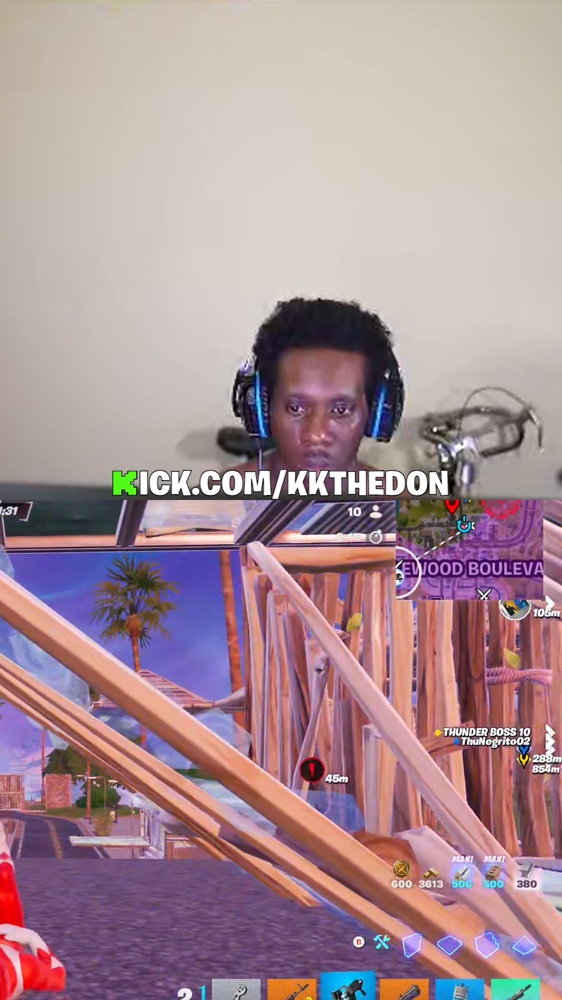
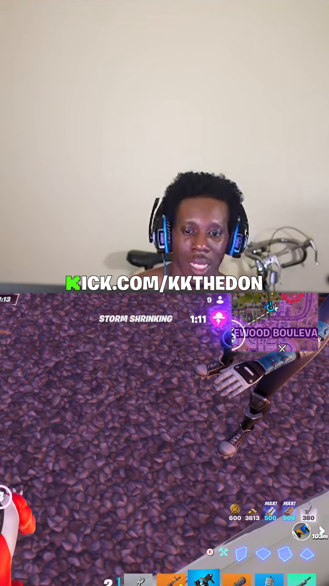
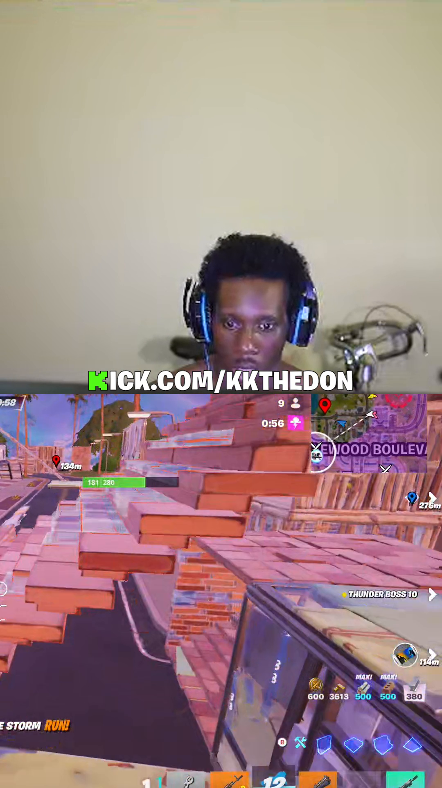
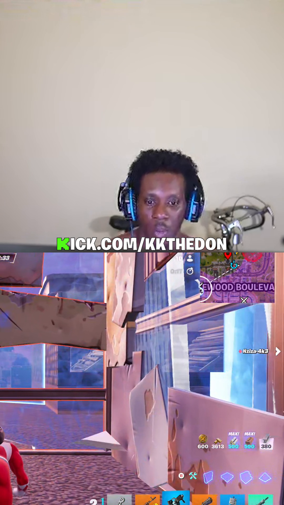
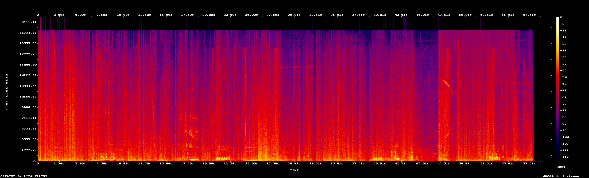

# Quality report — 2026-05-20 01-25-08_clip_1278_1338__split.mp4

- **Path:** `C:\Users\donald\Documents\ContentCreation\renders\split\2026-05-20 01-25-08_clip_1278_1338__split.mp4`
- **Duration:** 60.00 s
- **File size:** 87.28 MB
- **Overall bitrate:** 12202 kbps

## Video

- **Codec:** h264 (High)
- **Resolution:** 1080x1920
- **Frame rate:** 60/1
- **Pixel format:** yuv420p
- **Color primaries:** —
- **Color transfer:** —
- **Color space:** bt709
- **Color range:** tv
- **Bit rate:** 11942949 bps

## Audio

- **Codec:** aac
- **Sample rate:** 48000 Hz
- **Channels:** 2 (stereo)
- **Bit rate:** 249830 bps

## Loudness (ebur128)

- **Integrated:** -15.3 LUFS  (target: -14 for TikTok/IG)
- **Loudness range:** 7.2 LU  (target: ~7 LU for short-form)
- **True peak:** -0.0 dBTP  (must be < -1.0 dBTP to survive platform re-encode)

## Inspection artifacts

- 
- 
- 
- 
-   (dialogue-active frame — captions visible)
- 

## Captions (.ass sidecar)

- **Canvas:** PlayResX=1080, PlayResY=1920
- **Font:** Marker Felt 72pt, bold=1, alignment=8, MarginV=1020
- **Colors (mint preset expected):** primary=&H000000FF, secondary=&H000000FF, outline=&H00000000, back=&H00000000
  - Reference: TEXT=`&H000000FF` (red), HIGHLIGHT=`&H0000FFFF` (yellow)
- **Border / outline:** style=1, outline=5px
- **Dialogue events:** 34
- **Latin-script check:** PASS (every dialogue line is Latin script)

### Caption geometry

- **Inferred layout:** split  (canvas 1080x1920)
- **Line height:** 100.8 px = 5.25% of canvas  (< 8% required)
- **Caption baseline (MarginV):** 1020 px from top
- **Caption bottom edge (estimated):** y = 1120.8 px
- **Top safe area:** y < 120 px (platform UI zone)
- **Face-top heuristic:** y = 864.0 px  (captions must finish above this)
- **Horizontal margins:** L=0, R=0  (must be equal for top-center alignment)

**Professional-quality checks:**
- PASS `size_ok`
- PASS `centering_ok`
- PASS `above_safe_top`
- FAIL `face_clear (heuristic)`
- PASS `alignment_top_center`

**Overall verdict: FAIL**

**Why it failed:**
- Caption bottom edge at y=1121px crosses the heuristic face-top line at y=864px (45% down the split canvas). Captions will overlap the speaker's face. (If the streamer's webcam is in a non-typical position, this heuristic can false-positive — add face detection to disambiguate.)

### Sample dialogue (first 8 lines)

- `7.57s` -> `7.79s`: Holy fuck he's
- `7.79s` -> `8.07s`: Holy fuck he's
- `8.07s` -> `8.29s`: Holy fuck he's
- `8.29s` -> `8.41s`: getting a compound.
- `8.41s` -> `8.57s`: getting a compound.
- `8.57s` -> `8.77s`: getting a compound.
- `9.35s` -> `17.09s`: I just killed
- `17.09s` -> `17.19s`: I just killed
