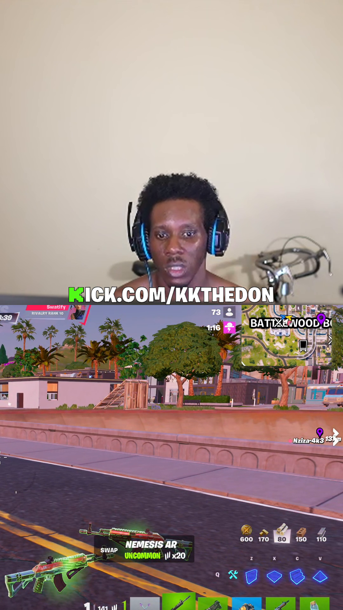
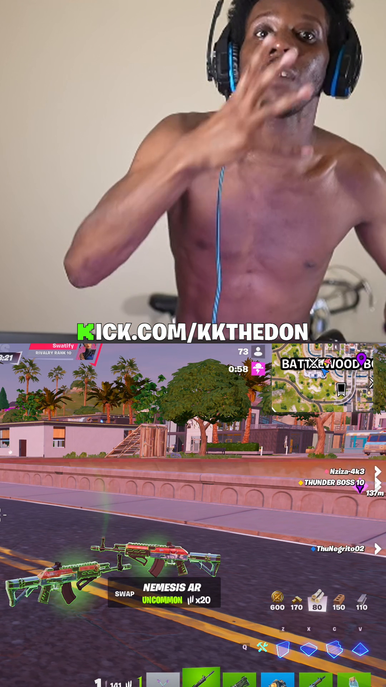
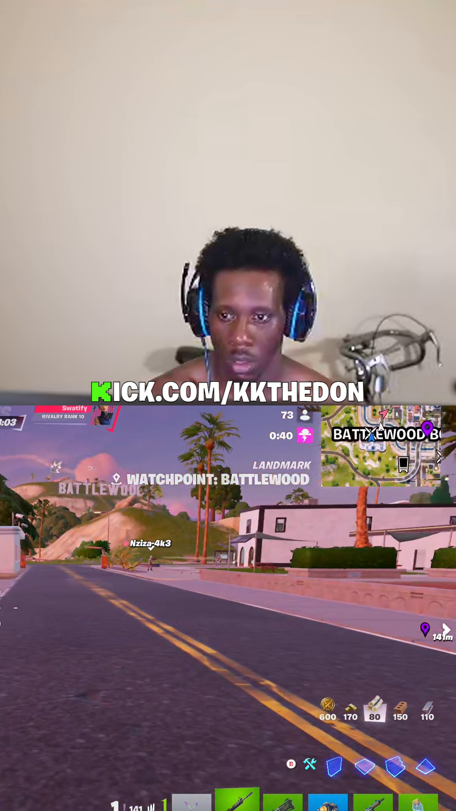
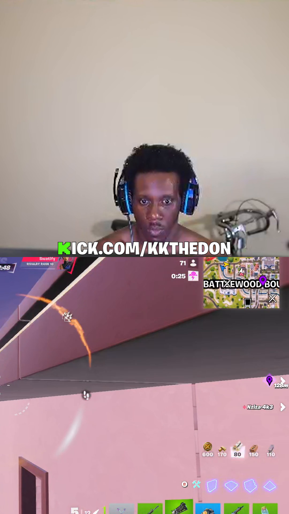
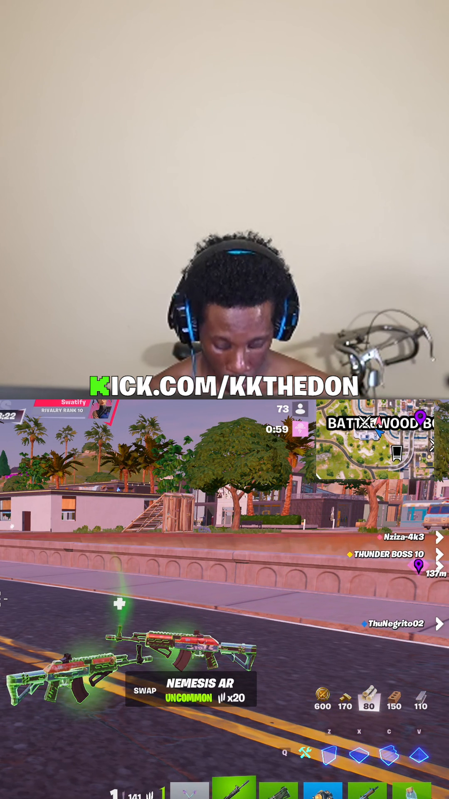
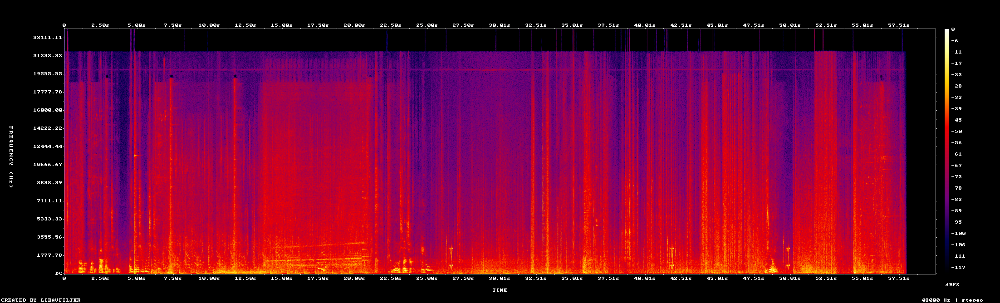

# Quality report — 2026-05-20 01-25-08_clip_1714_1774__split.mp4

- **Path:** `C:\Users\donald\Documents\ContentCreation\renders\split\2026-05-20 01-25-08_clip_1714_1774__split.mp4`
- **Duration:** 60.00 s
- **File size:** 62.62 MB
- **Overall bitrate:** 8755 kbps

## Video

- **Codec:** h264 (High)
- **Resolution:** 1080x1920
- **Frame rate:** 60/1
- **Pixel format:** yuv420p
- **Color primaries:** —
- **Color transfer:** —
- **Color space:** bt709
- **Color range:** tv
- **Bit rate:** 8493740 bps

## Audio

- **Codec:** aac
- **Sample rate:** 48000 Hz
- **Channels:** 2 (stereo)
- **Bit rate:** 251126 bps

## Loudness (ebur128)

- **Integrated:** -17.3 LUFS  (target: -14 for TikTok/IG)
- **Loudness range:** 5.9 LU  (target: ~7 LU for short-form)
- **True peak:** 0.2 dBTP  (must be < -1.0 dBTP to survive platform re-encode)

## Encoding & signal quality

**Verdict: WARN**

### Encoder & rate control

- **Encoder:** libx264  (`Lavc62.28.100 libx264`)
- **Rate control:** crf  CRF=18.0
- **Tune (inferred):** none / default
- **x264/x265 tuning params:** subme=8, ref=4, me=hex, trellis=2, rc_lookahead=50, bframes=3, b_adapt=1, aq=3:1.00, psy_rd=1.00:0.00, deblock=1:0:0, keyint=250, mbtree=1, weightp=2, 8x8dct=1

### Bitrate

- **Avg (measured):** 8474.5 kbps  (container reports 8755.4 kbps)
- **Peak / Min per second:** 16511.8 / 3484.0 kbps  (peak/avg=1.95, min/avg=0.41)
- **Bits per pixel:** 0.0681  (starved < 0.04, generous > 0.2; resolution 1080x1920 @ 60.0 fps)

### Levels & color (signalstats, clip average)

- **Luma** (range=tv): YMIN=None (crush < 14.0), YAVG=None, YMAX=None (clip > 237.0)
- **Chroma:** UAVG=None, VAVG=None  (neutral=128; V up + U down = warm/orange)
- **Saturation:** SATAVG=None  (high > 90 = over-processed)
- **Temporal diff:** YDIF=None  (motion/noise proxy)

### Detail / scaling / sharpening (sobel edge-energy, approx)

- **Edge-energy index:** None  (soft/over-denoised < 4.0, halos/over-sharp > 30.0; compare across renders of similar content)

### Flags

- COLOR TAGS: none written — some players guess BT.601 and tint playback.

## Inspection artifacts

- 
- 
- 
- 
-   (dialogue-active frame — captions visible)
- 

## Captions (.ass sidecar)

- **Canvas:** PlayResX=1080, PlayResY=1920
- **Font:** Marker Felt 72pt, bold=1, alignment=8, MarginV=1020
- **Colors (mint preset expected):** primary=&H000000FF, secondary=&H000000FF, outline=&H00000000, back=&H00000000
  - Reference: TEXT=`&H000000FF` (red), HIGHLIGHT=`&H0000FFFF` (yellow)
- **Border / outline:** style=1, outline=5px
- **Dialogue events:** 10
- **Latin-script check:** PASS (every dialogue line is Latin script)

### Caption geometry

- **Inferred layout:** split  (canvas 1080x1920)
- **Line height:** 100.8 px = 5.25% of canvas  (< 8% required)
- **Caption baseline (MarginV):** 1020 px from top
- **Caption bottom edge (estimated):** y = 1120.8 px
- **Top safe area:** y < 120 px (platform UI zone)
- **Face-top heuristic:** y = 864.0 px  (captions must finish above this)
- **Horizontal margins:** L=0, R=0  (must be equal for top-center alignment)

**Professional-quality checks:**
- PASS `size_ok`
- PASS `centering_ok`
- PASS `above_safe_top`
- PASS `face_clear (heuristic)`
- PASS `alignment_top_center`

**Overall verdict: PASS**

### Sample dialogue (first 8 lines)

- `0.56s` -> `1.28s`: Oh my fucking
- `1.28s` -> `1.48s`: Oh my fucking
- `1.48s` -> `2.10s`: Oh my fucking
- `2.10s` -> `2.58s`: god, I'm tired
- `2.58s` -> `3.12s`: god, I'm tired
- `3.12s` -> `3.17s`: god, I'm tired
- `3.12s` -> `3.18s`: of shit game
- `3.18s` -> `3.40s`: of shit game
